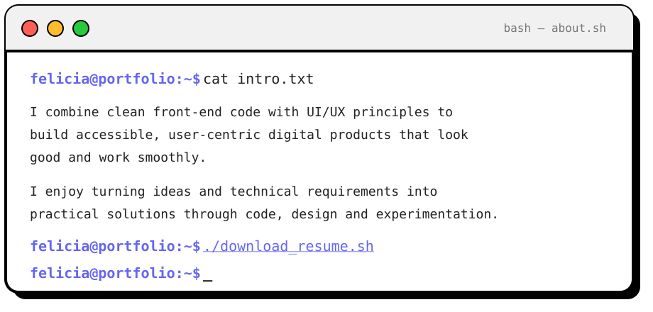

<h1 align="center">
  Hello, I'm &lt;Felicia Tan /&gt; 👋
</h1>

<h3 align="center">
  Year 2 IT Student @ Nanyang Polytechnic
</h3>

 

  

  
  
  
  

---

<h2 align="center">
  Current <i>Focus</i>
</h2>

<table>
  <tr>
    <td width="33%" align="center" valign="top">
      <h3>🎯 Focus</h3>
      <code>Frontend Development</code>  
      <code>UI/UX Design</code>  
      <code>Full-Stack Development</code>
    </td>
    <td width="34%" align="center" valign="top">
      <h3>🌱 Exploring</h3>
      <code>Artificial Intelligence</code>  
      <code>Internet of Things</code>  
      <code>AWS Cloud</code>  
      <code>DevSecOps</code>
    </td>
    <td width="33%" align="center" valign="top">
      <h3>🚀 Building</h3>
      <code>FlowGuard</code>  
      <code>SwapLah</code>  
      <code>MakerLab</code>
    </td>
  </tr>
</table>

---

<h2 align="center">
  Technical <i>Stack</i>
</h2>

<table align="center">
  <tr>
    <td align="center" width="10%">
       
      <b>HTML</b>
    </td>
    <td align="center" width="10%">
       
      <b>CSS</b>
    </td>
    <td align="center" width="10%">
       
      <b>JavaScript</b>
    </td>
    <td align="center" width="10%">
       
      <b>TypeScript</b>
    </td>
    <td align="center" width="10%">
       
      <b>Python</b>
    </td>
  </tr>
  <tr>
    <td align="center">
       
      <b>React</b>
    </td>
    <td align="center">
       
      <b>Node.js</b>
    </td>
    <td align="center">
       
      <b>Flask</b>
    </td>
    <td align="center">
       
      <b>AWS</b>
    </td>
    <td align="center">
       
      <b>Figma</b>
    </td>
  </tr>
</table>

  

---

<h2 align="center">
  GitHub <i>Activity</i>
</h2>

  <picture>
    <source
      media="(prefers-color-scheme: dark)"
      srcset="https://github-profile-summary-cards.vercel.app/api/cards/stats?username=feliciatanxl&theme=github_dark"
    />
    <source
      media="(prefers-color-scheme: light)"
      srcset="https://github-profile-summary-cards.vercel.app/api/cards/stats?username=feliciatanxl&theme=default"
    />
    
  </picture>
  <picture>
    <source
      media="(prefers-color-scheme: dark)"
      srcset="https://github-profile-summary-cards.vercel.app/api/cards/most-commit-language?username=feliciatanxl&theme=github_dark"
    />
    <source
      media="(prefers-color-scheme: light)"
      srcset="https://github-profile-summary-cards.vercel.app/api/cards/most-commit-language?username=feliciatanxl&theme=default"
    />
    
  </picture>

  <picture>
    <source
      media="(prefers-color-scheme: dark)"
      srcset="https://github-readme-activity-graph.vercel.app/graph?username=feliciatanxl&bg_color=0D1117&color=C9D1D9&line=818CF8&point=FFFFFF&area=true&hide_border=true"
    />
    <source
      media="(prefers-color-scheme: light)"
      srcset="https://github-readme-activity-graph.vercel.app/graph?username=feliciatanxl&bg_color=FFFFFF&color=000000&line=6366F1&point=000000&area=true&hide_border=false"
    />
    
  </picture>

---

  <code>felicia@github:~$ Building ideas through code, design and experimentation._</code>

