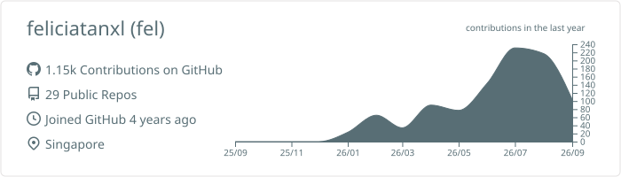
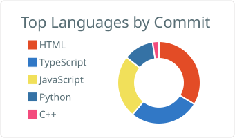

<h1>Felicia Tan</h1>

<h3>Frontend Developer · UI/UX Designer · IT Student</h3>

  I create practical digital experiences through 
  <strong>thoughtful design, accessible interfaces and reliable code.</strong>

 

 

## About me

I am a Year 2 Diploma in Information Technology student at **Nanyang Polytechnic**, with an interest in frontend development, UI/UX design and full-stack applications.

I enjoy working across the product-development process—from understanding user needs and designing interfaces to implementing features, testing systems and improving deployment workflows.

### What I bring

🎨 **Design thinking** — User-centred interfaces, prototyping and accessibility  
💻 **Development skills** — Frontend, backend and API integration  
🧪 **Quality mindset** — Testing, security scanning and CI/CD workflows  
🤝 **Collaboration** — Iterative development, documentation and teamwork  

 

## Selected work

#### `01 / FLOWGUARD`

### AI Smart Factory Monitoring

> An AI-powered facility-monitoring platform designed to improve access control, safety awareness and operational visibility.
>
> **My contribution**  
> Developed facial recognition and access-control features, role-based user management, smart logistics workflows and responsive interface improvements.
>
> **Technology stack**  
> `React` `Node.js` `Python` `FastAPI`

---

#### `02 / ECHOSYNC`

### Emergency Intelligence for Seniors

> A privacy-focused emergency-monitoring ecosystem that uses sensors, multilingual voice interaction and caregiver alerts to support seniors living alone.
>
> **My contribution**  
> Worked on frontend development, UI/UX design, dashboard workflows, sensor-to-interface integration and caregiver-response interfaces.
>
> **Technology stack**  
> `React` `Python` `Arduino` `Raspberry Pi`

---

#### `03 / SWAPLAH`

### Campus Marketplace & DevSecOps

> A secure campus marketplace where students can buy and sell pre-owned essentials through trusted account and listing workflows.
>
> **My contribution**  
> Implemented full-stack features, authentication and listing workflows, automated testing, security scanning and GitLab CI/CD processes.
>
> **Technology stack**  
> `Flask` `SQLite` `Pytest` `Selenium` `GitLab CI/CD`

---

#### `04 / MAKERLAB`

### Embedded Systems Playground

> A collection of hardware, IoT and embedded-system experiments exploring how software interacts with sensors and physical devices.
>
> **My contribution**  
> Worked on sensor integration, Raspberry Pi applications, serial communication, technical testing and project documentation.
>
> **Technology stack**  
> `Arduino` `ESP32` `Raspberry Pi` `Python`

 

  

  Source code and technical documentation are available through my pinned repositories.

 

## Technical toolbox

  

 

## GitHub overview

  <picture>
    <source
      media="(prefers-color-scheme: dark)"
      srcset="./profile-summary-card-output/github_dark/0-profile-details.svg"
    >
    <source
      media="(prefers-color-scheme: light)"
      srcset="./profile-summary-card-output/default/0-profile-details.svg"
    >
    
  </picture>

  <picture>
    <source
      media="(prefers-color-scheme: dark)"
      srcset="./profile-summary-card-output/github_dark/2-most-commit-language.svg"
    >
    <source
      media="(prefers-color-scheme: light)"
      srcset="./profile-summary-card-output/default/2-most-commit-language.svg"
    >
    
  </picture>

 

<h3>Let’s build something useful.</h3>
<code>Design with purpose · Build with care · Improve through iteration</code>

