<div align="center">
  
</div>

<p align="center">
  <a href="https://feliciatanxl.github.io/Portfolio/">
    
  </a>
  <a href="https://www.linkedin.com/in/feliciatanxl/">
    
  </a>
  <a href="mailto:feliciatanxl@gmail.com">
    
  </a>
  <a href="https://github.com/feliciatanxl">
    
  </a>
</p>

---

## `felicia@github:~$ cat intro.txt`

```text
I combine clean frontend development with UI/UX principles
to build accessible, user-centred digital products that
look good and work smoothly.

I enjoy turning ideas and technical requirements into
practical solutions through code, design and experimentation.
```

---

## `felicia@github:~$ neofetch`

```yaml
felicia@github
--------------------------------
Host      : Nanyang Polytechnic — Year 2 IT
Role      : Frontend Dev · UI/UX Design · Full-Stack
Uptime    : Building & shipping since 2021
Focus     : Accessible, user-centred products
Exploring : AI · IoT · AWS Cloud · DevSecOps
Editor    : VS Code · Figma
Status    : Open to opportunities & collaboration
```

---

## `felicia@github:~$ ls featured_projects/`

| Project | What I worked on | Main technologies |
|---|---|---|
| **FlowGuard** | Facial recognition, access control, user management and smart logistics for an AI-powered facility monitoring platform | `React` `Node.js` `Python` `FastAPI` |
| **EchoSync** | Emergency monitoring for seniors using sensors, multilingual voice interaction and caregiver alerts | `React` `Python` `Arduino` `Raspberry Pi` |
| **SwapLah** | Secure student marketplace with listings, automated testing, security scanning and CI/CD | `Flask` `SQLite` `Pytest` `Selenium` `GitLab CI/CD` |
| **MakerLab** | Arduino, Raspberry Pi, IoT and hardware-software experiments | `Python` `C/C++` `Arduino` `ESP32` |

> `# Explore my pinned repositories below for source code and documentation.`

---

## `felicia@github:~$ cat tech_stack.txt`

<p align="center">
  
</p>

---

## `felicia@github:~$ git log --stat`

<p align="center">
  
  
</p>

---

```bash
felicia@github:~$ echo $MOTTO
> "Building accessible digital experiences through code & design."
felicia@github:~$ _
```
